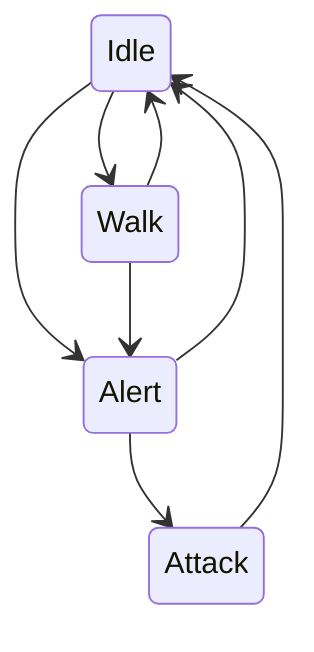

# Estados de Unit

Estados posibles de una unidad.

```mermaid

    stateDiagram-v2
        Idle --> Walk
        Idle --> Alert
        Walk --> Idle
        Walk --> Alert
        Alert --> Attack
        Alert --> Idle
        Attack --> Idle
```

## Idle

La unidad esta quieta.

## Walk

La unidad patrulla.

## Alert

La unidad detecto un enemigo cerca.

## Attack

La unidad va a atacar.
